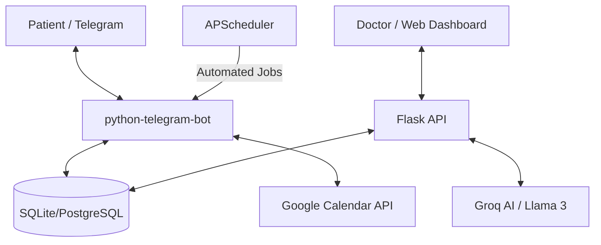

# 🏥 CareDost: Intelligent Clinic Management

[](https://www.python.org/downloads/)
[](https://flask.palletsprojects.com/)
[](https://core.telegram.org/bots)
[](https://opensource.org/licenses/MIT)

**CareDost** is a comprehensive, AI-enhanced clinic management solution designed to bridge the gap between small clinics and modern digital healthcare. It automates the entire patient journey—from booking and reminders to post-consultation care—allowing doctors to focus on what matters most: **healing.**

---

## 📽️ The CareDost Experience

| **Patient Journey (Telegram)** | **Doctor Interface (Web)** |
| :--- | :--- |
| Seamless booking with Google Calendar sync. | Minimalist, high-performance consult dashboard. |
| Automatic reminders & Pre-visit forms. | AI-powered medical note expansion (Llama 3). |
| Digital prescriptions & Medication alerts. | Integrated chat history & file management. |

---

## 🔥 Core Features

### 🤖 Intelligent Patient Bot
*   **Frictionless Booking:** 24/7 appointment scheduling with real-time slot availability.
*   **Smart Reminders:** Automated 2-hour reminders and 1-hour pre-visit questionnaires to reduce "no-shows."
*   **Digital Health Records:** Instant access to visit summaries, prescriptions, and digital medication alerts.
*   **Spam Protection:** A built-in credit system ensures meaningful communication and prevents bot abuse.

### 👨‍⚕️ Advanced Doctor Dashboard
*   **AI Clinical Assistant:** Expand medical shorthand into professional clinical notes using **Llama 3.3 (70B)** via Groq.
*   **Dynamic Re-visits:** Schedule follow-ups with one click; the system automatically books the slot and notifies the patient.
*   **Emergency Broadcast:** Send mass notifications or cancellations to all patients booked for a specific day.
*   **Comprehensive History:** View patient-uploaded files, photos, and full chat transcripts in a unified timeline.

---

## 🏗️ System Architecture



---

## 🛠️ Tech Stack

*   **Backend:** Flask (Python 3.10+)
*   **Bot Framework:** python-telegram-bot (AsyncIO)
*   **Database:** SQLAlchemy (SQLite for Dev, PostgreSQL support for Prod)
*   **AI Engine:** Groq Cloud SDK (Llama 3.3 70B Versatile)
*   **Scheduling:** APScheduler
*   **Formatting:** FPDF2 (Digital Prescriptions)

---

## 🚀 Getting Started

### Prerequisites
*   Python 3.10 or higher
*   A Telegram Bot Token (from [@BotFather](https://t.me/botfather))
*   Groq API Key (from [Groq Console](https://console.groq.com/))
*   Google Cloud Project with Calendar API enabled

### 1. Clone & Install
```bash
git clone https://github.com/rxdrxksh01/CareDost.git
cd CareDost
python3 -m venv venv
source venv/bin/activate
pip install -r requirements.txt
```

### 2. Configure Environment
Create a `.env` file:
```env
TELEGRAM_BOT_TOKEN=your_bot_token
DATABASE_URL=sqlite:///clinic.db
GROQ_API_KEY=your_groq_key
DASHBOARD_USERNAME=doctor
DASHBOARD_PASSWORD=your_secure_password
SECRET_KEY=your_random_secret_key
```

### 3. Launch
```bash
# Terminal 1: Bot & Schedulers
python main.py

# Terminal 2: Doctor Dashboard
python -m dashboard.app
```

### 4. Quick Deploy on Render (Simple)
1. Push this repo to GitHub.
2. In Render, create a new **Blueprint** service from the repo (it uses `render.yaml`).
3. Add env vars:
   - `TELEGRAM_BOT_TOKEN`
   - `GROQ_API_KEY`
   - `SECRET_KEY` (any strong random string)
   - `DATABASE_URL` (use Render Postgres URL in production)
4. Deploy.

Health check URL after deploy:
`https://<your-service>.onrender.com/health`

---

## 🛡️ Security & Privacy
*   **Encapsulated Credentials:** All sensitive keys are managed via environment variables.
*   **Session Management:** Secure Flask-Login implementation for doctor access.
*   **Data Integrity:** Transactional database operations to prevent data loss or double-booking.

---

## 🗺️ Roadmap
- [ ] **Phase 1:** Dockerization for easy deployment.
- [ ] **Phase 2:** Multi-doctor/owner support with dedicated permissions.
- [ ] **Phase 3:** WhatsApp Business API integration.
- [ ] **Phase 4:** Advanced analytics dashboard for clinic growth.

---

## 📄 License
Distributed under the **MIT License**. See `LICENSE` for more information.

---
**Developed with ❤️ by [Rudraksh Sharma](https://github.com/rxdrxksh01)**
